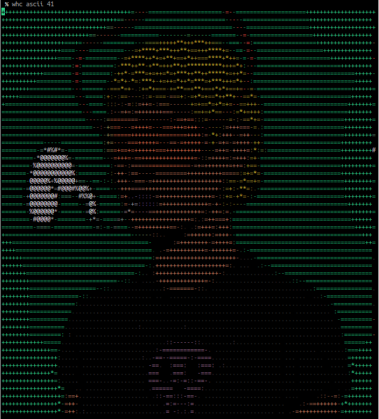

# whc

## install

```bash
go install github.com/ledmonster/whc@latest
```

## usage

```whc
whc ascii [-w <width>] token_ids ...
```

## run

```
$ whc ascii 41
+++++++++++++++++++=--============--===========++++++++++
+++++++++++++++==--=================--==========+++++++++
++++++++++===---======+++++++++++====--==========++++++++
++++++++===--====-=++*+*+**+*+++**++=--============++++++
+++++++====-====--+++++++++*+**+**+=*--===============+++
++++=======--===-=+=--+====+=+*=+*++=-================+++
+===========-===::--:==-==---=+++++===+==============++++
=============----========--==--==---==+=-============++++
==============-:====++======++--=-=+===-============+++++
======+*+======-=====+++====++=-=+=-++==-===========+++++
=====#@@@@*-====-==-===+++++==--=+==+===============+++++
===-*@@%@@@+====--+-==-======+++++==-=+=============+++++
===-%@@%*##*%#===-==-===+++++++++--==+:-=============++++
===-%@@@*-===@*===-==:::=++++++==---=-===============++++
====+%%#====-++-=====++++++==--=+==-==================+++
=======================::...:=++-=+-===================++
++=====================  :=++++==++=--===================
+++===================--++++++++++=-...:-================
++++==============--:..:+++++++==:. ......::--===========
++++========--::.........:----:.................:-=======
++++=======:............. ........................:======
++++======..........................................=====
+++++====:..........................................:====
++++++++=...............-======:.....................==++
+++++++*-..............=: ==. -+:....................-*++
++++++++-. . .........:+:.-::.=-.................. . :+++
++++++++*-:-...........:-=:.==:..............  ..::::=+++
+++++++++=+-............ ::::: ............  :-=+++==*+++
```

You can see your Hacker like this:


